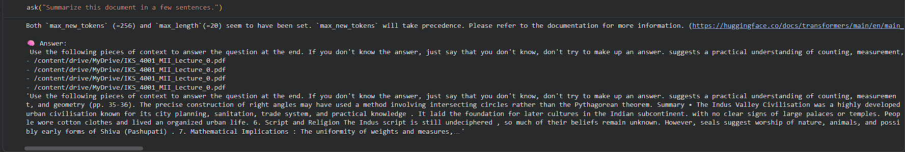

# AI Document Q&A using RAG

## Overview
This project implements a Retrieval-Augmented Generation (RAG) system that enables users to query PDF documents and receive accurate, context-aware answers using LLMs.

## Structure
ai-rag-document-qa/
 ├── RAG_pdf_bot.ipynb
 ├── README.md        
 ├── screenshot.png
 ├── IKS_4001_MII_Lecture_0.pdf (used as sample.pdf)
 
## Features
- 📄 PDF document ingestion
- ✂️ Text chunking for efficient processing
- 🔍 Semantic search using FAISS vector database
- 🤖 LLM-based answer generation (HuggingFace)
- ⚡ Fast and context-aware responses

## Tech Stack
- Python
- LangChain
- FAISS (Vector Database)
- HuggingFace Transformers
- Google Colab

## How it Works
1. Load PDF document
2. Split into smaller chunks
3. Convert chunks into embeddings
4. Store embeddings in FAISS
5. Retrieve relevant chunks based on query
6. Generate answer using LLM

## Architecture
PDF → Chunking → Embeddings → FAISS → Retrieval → LLM → Answer

## Key Concepts
- Retrieval-Augmented Generation (RAG)
- Semantic Search
- Vector Embeddings
- Context-aware Answer Generation

## Example Query
### Query
Summarize this document in a few sentences.

### Answer
The precise construction of right angles may have used a method involving intersecting circles rather than the Pythagorean theorem. Summary • The Indus Valley Civilisation was a highly developed urban civilisation known for its city planning, sanitation, trade system, and practical knowledge . It laid the foundation for later cultures in the Indian subcontinent. with no clear signs of large palaces or temples. People wore cotton clothes and lived an organized urban life. 6. Script and Religion The Indus script is still undeciphered , so much of their beliefs remain unknown. However, seals suggest worship of nature, animals, and possibly early forms of Shiva (Pashupati) . 7. Mathematical Implications : The uniformity of weights and measures, along with sophisticated architecture and potential celestial navigation for trade, 3. Economy and Trade The people were mainly farmers and traders . They grew wheat, barley, cotton, and traded with distant regions like Mesopotamia . Standardized weights and measures were used for trade. 4. Technology and Crafts The civilisation was skilled in pottery, bead-making, metallurgy, and seal carving . Seals made of steatite were used for trade and identification. 5. Social Life and Culture Evidence suggests a peaceful society with no clear signs of large palaces

## Output Screenshot

## Future Improvements
- FastAPI backend for API access
- Deployment on AWS / cloud platform
- Frontend interface (React)
- Support for multiple documents
- Performance optimization

## Author
Developed as part of learning AI + Backend integration using RAG pipelines.
